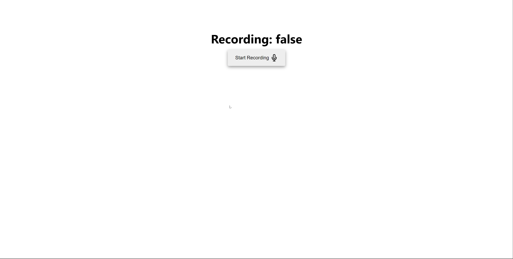

# 0.8.0

- Add `setResults` to hook return values in order to have more control of manually setting the results state array. Thanks to https://github.com/marharyta for the suggestion https://github.com/Riley-Brown/react-speech-to-text/issues/12
- Fixed bug where `handleRecordingTimeout` would not be cleared when repeatedly calling `startSpeechToText` causing recording to stop unexpectedly
- Remove `setIsRecording(false)` from `speechEvents.on('stopped_speaking')` event logic in order to have more consistent functionality between both WebSpeechAPI and cross-browser google cloud platforms.

  - Previously `setIsRecording(false)` was being called here because technically the microphone stops recording when `stopRecording` is invoked in `src/Hooks/index` line 236 until the google cloud API promise gets resolved. However, this is not the case when using the Chrome WebSpeechAPI as the WebSpeechAPI continues recording microphone and `setIsRecording(false)` is only called on the `recognition.onend` event.

  - This could be a potential breaking change if previous code was expecting the `isRecording` boolean to change during the few hundred milliseconds it takes for the google cloud API promise to resolve

- Update `package.json` `peerDependencies` of `react` and `react-dom` from `^16.8.0` to `>=16.8.0` to potentially fix issues using latest versions of react. Thanks to https://github.com/abhi8233 for reporting https://github.com/Riley-Brown/react-speech-to-text/issues/13

# 0.7.0

- Add new `useLegacyResults` hook arg to opt into new array of objects results
- Add new array of objects results containing timestamp, transcript and speechBlob properties for each speech result
- Add default `timeout` value of 10000
- Add default `speechRecognitionProperties` value of `{ interimResults: true }` for displaying realtime speech to text result

It is recommended to opt into new results by passing `useLegacyResults: false` as the legacy array of string results will be completely removed in a future version

# 0.6.0

- Added functionality to return real-time speech result while speaking for `SpeechRecognition` web API

Hook now returns an `interimResult` variable which is a string and will be updated as you speak if opting in using the speech recognition properties config of `speechRecognitionProperties: { interimResults: true }`

ex:

```JSX
 const {
    error,
    isRecording,
    results,
    startSpeechToText,
    stopSpeechToText,
    interimResult
  } = useSpeechToText({
    continuous: true,
    crossBrowser: true,
    googleApiKey: process.env.REACT_APP_API_KEY,
    timeout: 10000,
    speechRecognitionProperties: { interimResults: true }
  });

  return (
     <ul>
        {results.map((result, index) => (
          <li key={index}>{result}</li>
        ))}
        {interimResult && <li>{interimResult}</li>}
      </ul>
  )
```

- When SpeechRecognition result event returns `isFinal`, the `interimResult` value will be set to `undefined`, this allows you to conditionally display the real-time interimResult while speech is in progress, then display the final result from the results array once result is final


